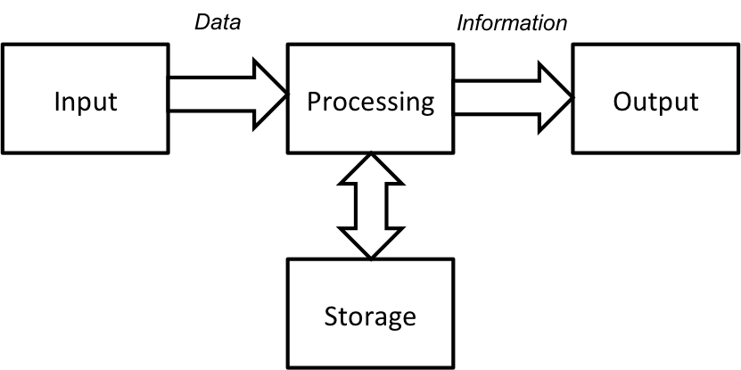
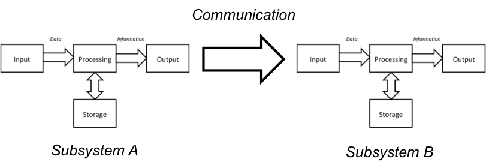

On Information Systems and Patent Eligibility
=============================================

## Introduction

Much uncertainty exists today regarding whether, and to what extent, software-related inventions are eligible for patent protection in the United States. This unease among practitioners about where statutory boundaries lie finds roots in conflict between the nature of computer software and the Patent Act's recitation of permitted subject matter.

The Supreme Court has been unable to articulate exactly what it meant when it held fourty years ago in *Gottschalk v Benson* that procedure for solving a mathematical problem, in the form of a computer program, may not be patented. Such an "algorithm," the Court wrote, amounted to patenting the mathematical principle itself. The problem with this language in *Benson* is that *all* computer programs are by definition a procedure for solving one or more mathematical problems. All computer programs are algorithms, or a collection of algorithms. They are are simply a series of instructions for a computer system to follow -- a series of steps. Why then do computer programs not expressly fall under Section 101's identification of a "process" or "method"?

Additionally, computer programs are provided to a computer as software in tangible form, whether that form is as fixed as on optical disc media, or as ephemeral as a time-series of electrical impulses. The very nature of the computer hardware changes upon executing the instructions of program. It is now a "new" computer, because the tangible hardware components now function in an entirely different way. Shouldn't such a programmed computer be a "new and useful ... machine" for which a patent can be obtained?

These arguments have been made for decades to support the patentability of computer software. Yet the Supreme Court, with one exception, has rejected these arguments and held that claims sought for computer-related inventions are ineligible subject matter. The Supreme Court's reasoning in these opinions do not provide an adequate as a framework to evaluate patent eligibility. The Court has used language describing exceptions to patent eligibility such as "[p]henomena of nature, though just discovered, mental processes, and abstract intellectual concepts." This is not a clear articulation of the principles at issue. All inventions, as the Court itself has warned, can be reduced to an abstract idea.

This paper proposes a different framework in which to evaluate computer-related inventions. It begins by taking a step back to look at computers in their most general sense -- as an *information system*, meaning it manipulates data to produce more useful information. Information systems, whether implemented by a digital computer executing a software program, by a human using pen and paper to solve a mathematical formula, or by an organized group of people in communication, are the "basic tools of scientific and technological work" that the Court has consistently sought to preserve as free for mankind to use. Thus, as an initial matter, information systems are not eligible for patent protection. When the patentee claims to have invented an information system or method of using one, the patentee has only claimed a bare idea, no different than claiming a notion of using the human mind. Exceptions to this principle that may warrant patent protection arise only when the applicant has solved a specific technological problem encountered while implementing the information system, or has applied the information system as a tool in a "new and useful way" to transform a physical substance.

This framework, in fact, reveals that the Supreme Court has taken an almost entirely consistent approach to patent eligibility over the past 150 years, since long before the arrival of digital computers. The holdings are not *ad hoc* or arbitrary. We can now abandon vague notions such as "mathematical principles" or "abstract ideas" as bellwhethers, and understand when to disregard recitations of technology as "insignificant post-solution activity." Finally, it is safe for us affirm that a novel computer program or algorithm may, under appropriate circumstances, be declared patentable.

Below, the author discusses first how to define an "information system" and the role that a general-purpose computer plays. Next, the paper reviews the principles of patentability declared by the Supreme Court. Then we examine how the Supreme Court has responded to the appearance of computer-based information systems. Finally, the author proposes a framework for evaluating the patentability of information systems, whether computer-based or otherwise.

## Information Systems and the Information Age

### Information

We frequently hear that civilization is presently witnessing the "Information Age." For the past several decades, the advancement of technology has been driven by a new paradigm of understanding that surpasses the mere tangible world. People now know that *information*, surprisingly, is not just a philosophical notion, but something can actually be quantified, measured, analyzed, and transformed in a well-defined mathematical sense.

Claude Shannon is widely credited with launching the scientific field of Information Theory through his publication of a "A Mathematical Theory of Communication." Shannon explored the fundamental mathematics at issue when dealing with information and the communication of information in order. Some readers may be surprised to learn that, according to Shannon's theory, the first paragraph of this paper contains only 1740 bits of information, even though its computer representation takes of 2784 bits of storage space.

These mathematical understandings about what information is and how to measure it have led to an information revolution, resulting in advancements in digital computers, communication, data compression, quantum computing, philosophy[^flo2005]. There is even an aspect of theoretical physics that posits that all the information that makes up the three-dimensional world as we experience is actually encoded as a two-dimensional structure -- just like a hologram appears to have depth, yet is physically flat.

But for our purposes, the recent investigation into the nature of information itself, rather than its application to hard sciences and engineering, is important. The elevation of information as something to be understood allows us to look introspectively into how the processing of information is applied as a "basic tool" among humans. One area studying information looks at how information is used systematically in organizations. Unsurprisingly, this field of theory is called "information systems."

[^flo2005]: Is Semantic Information Meaningful Data?, Philosophy and Phenomenological Research Vol. LXX, No. 2, March 2005.

### The Information System

Before we describe what an information system is we must first address the ambiguity of the word *information*.  Because information has several semantic meanings, researchers of information systems have generally adopted two other words -- data and knowledge -- that help distinguish among these different meanings.[^info] Briefly, *data* refers to the syntax, *information* is its interpretation, and *knowledge* is how people use the information.[^derAalst].  Stated another way, data is input that is processed and output into meaningful information to convey knowledge as understanding, experience, accumulated learning, and expertise.[^tra1991] For example, "January 29, 1966" may be a sequence of letters and numbers (data), processed as a person's birthday (information), and can inform us when to throw a big party because the person has turned fifty years old (knowledge).

[^tra1991]: Eileen M. Trauth et al, Information Literacy: An Introduction to Information Systems (1st Ed. 1991)

[^derAalst]: Wil van der Aalst and Christian Stahl, Modeling Business Processes (ISBN 9780262015387) http://mitpress.mit.edu/sites/default/files/9780262015387_sch_0001_0.pdf

[^info]: See also:
    * Information is data that has been processed into a form that is meaningful to the recipient. Davis and Olson, Management Information Systems (1985), 200.
    * Data is the raw material that is processed and refined to generate information. Silver and Silver, Systems Analysis and Design (1989), 6.
    * Information equals data plus meaning. Checkland and Scholes. Soft Systems Methodology in Action (1990), 303.
    * Luciano Floridi, The Philosphy of Information (2011)

An *information system* is a system that manages and processes data and information to create knowledge.[^laudon] We use system here in its broadest sense as a set of connected things or parts forming a whole, not in any computer-based or technical sense. One commentator provides a simple example to understand what an information system is as a general concept:

> A patient who consults a family doctor usually first tells the doctor about the symptoms. With this information, the doctor examines the patient and makes a diagnosis. Afterward, the doctor determines the treatment to heal the patient. For example, based on the diagnosis, the doctor may write the patient a prescription for some medication. Finally, the doctor must document the symptoms, the diagnosis, and the treatments. [^derAalst]

In this example, the doctor receives data from a patient as a description of symptoms; the doctor processes the data based upon pre-existing medical knowledge to derive useful information in the form of a diagnosis. The doctor now has the knowledge to determine what treatments to use on the patient. The doctor manages this information by storing it with the data and associated knowledge.

No computers are present in this example, even though they could have been used. Instead, we are presented with merely an organization of humans -- a patient and a doctor -- following a defined process: communicating symptoms and processing those symptoms to determine a treatment. In fact, understanding that the concept of an information system is not bound by any computer technology is critically important for our purposes.

The basics of an information system are four-fold, as seen in Fig. ___ below. Data is received by an input means. Processing means manipulate the data to produce information. An output means presents or displays the information in useful form. Storage means help retain the information, which may be only temporary as during the processing, or may be for much longer, until recalled at a later time.

Oftentimes times a fifth aspect is involved: communication. And that is because an information system can be described as a larger system comprising of various information *subsystems*. In order to interoperate these systems must talk to each other, exchanging the data and information that is being processed, as seen in Figure ___ below.

The reader can see that an information system is actually a very simple model of how a human being interacts with the environment. [^von] The senses (e.g., sight and hearing) are the input means. The processing and storage means are the brain, which seeks to comprehend the data collected by the senses and remember them and their meaning. The output means are the muscles controlled by motor neurons (e.g., voice and limb movement). Finally, humans interact with each other in organizations by communication, whether oral, written, through non-verbal cues, or by computers. A collection of people as a whole, such as a news organization, can input data of current events, work together to create meaningful information from the chaos, and output useful information in print, television or the Internet. Returning to our medical diagnosis example, the patient and doctor are each an information subsystem comprising an overall system where both actors are in communication.[^vander]

[^laudon]: Ken Laudon and Jane Laudon, Management Information Systems (12th ed. 2012) ("Information systems are interrelated components working together to collect, process, store, and disseminate information to support decision making, coordination, control, analysis, and visualization in an organization.")"

[^von]: Cf. John von Neumann, First Draft of a Report on the EDVAC (June 30, 1945).

[^vander]: "[A]n information system manages and processes information. This definition is general and allows different interpretations. For example, it is not clear whether 'information system' refers only to software systems or also to humans, such as a family doctor who manages and processes information." Wil van der Aalst and Christian Stahl, Modeling Business Processes (ISBN 9780262015387) http://mitpress.mit.edu/sites/default/files/9780262015387_sch_0001_0.pdf

One final consideration that is important when discussing information systems arises because of their need to communicate with their surrounding environment. A logical boundary exists between the information system and its environment, or between two subsystems, called an *interface*. The interface describes the characteristics of the means of inputing, outputing, and communicating. For example, when humans and computers interact, we often refer to this boundary as a human-computer interface. Various forms of human-computer interfaces have been employed over the years, such as hardware input devices like keyboards, voice recognition, and touch screens, or software such as graphical windows desktops or Internet search engines. Interfaces need not involve computers. A standard paper form for an inter-office memo is an example of a human-human interface in a corporation. Nor must interfaces involve humans. Computers, for example, sense the physical world using hardware instruments such as atmospheric sensors or gyroscopes. And computer software programs communicate with each other using a well-defined set of instructions called an application programming interface, referred to commonly as an API.

A variety of activities have been conventionally performed in information systems in order to accomplish the goal of creating meaningful information from data. The table below identifies several, although this list is certainly not exclusive.[^trauth1] [^valacich]

Activity              | Description
--------              | -----------
Recording/originating | Collecting, creating, or updating data
Classifying           | Arranging data according to characteristics and properties
Arranging             | Organizing data into a logical structure, such as a table
Sorting               | Ordering data in some sequential arrangement
Calculating           | Applying mathematical formulas or operations on data
Summarizing           | Reducing voluminous data to a more convienient and concise form
Storing               | Persisting data (either temporarily or for long-term preservation) for future recall
Retrieving            | Recalling stored data
Reproducing           | Copying data (either temporarily for for long-term usage)
Communicating         | Sending or distributing information between information subsystems, whether to a person or a machine

[^trauth1]: Eileen M. Trauth et al, Information Literacy: An Introduction to Infromation Systems (1st Ed. 1991) at 87.

[^valacich]: See Joseph Valacich and Christoph Schneider, Information Systems Today - Managing in the Digital World (4th Ed. 2010) ("Information systems are combinations of hardware, software, and telecommunications networks that people build and use to collect, create, and distribute useful data, typically in organizational settings").

As can be seen by these functions, information systems are not limited to a particular implementation environment. Many of these activities are the kind people have long been involved in, before digital computers, and even since the beginnings of recorded civilization. Ancient Bablyonians organized data into tables, just as today we create tables in spreadsheets on computer systems.[^enfish] More than two millenia ago, librarians at the Great Library of Alexandria stored and organized the books and records in rooms and bins by subject and author, and created a catalogue list of the holdings in a separate collection of scrolls.[^phillips]

Even though humans and human organizations can be the sole parties involved in processing information, in the modern world researchers have been more concerned with the application of technology to these methods.[^deraalst] Many tools and technologies have been created over the years to replace or assist people, such as notebooks, file cabinets, mechanical adding machines, typewriters, slide rulers, scientific formulas, and telephones.[^trauth2]

The most important addition to the mix has been the general-purpose digital computer. The computer has several main advantages over humans and mechanical tools. First, it is *faster* and more accurate.[^trauth] Second, it can make immediate decisions and *automatically* carry them out.[^trauth2] Most importantly, as explained in the next section, a general-purpose digital computer is a *universal* calculating machine. As a universal machine, the computer can be programmed to perform *any* calculation that can be imagined. The computer just needs to be given the appropriate instructions and provided sufficient resources to carry it out.

[^trauth2]: See, e.g., Eileen M. Trauth et al, Information Literacy: An Introduction to Infromation Systems (1st Ed. 1991) at 87 (listing several information processing tools).

[^enfish]: Enfish, LLC v. Microsoft Corp., No. 2:12-CV-07360-MRP, 2014 WL 5661456 (C.D. Cal. Nov. 3, 2014) (noting "[f]or millennia, humans have used tables to store information." and citing Martin Campbell–Kelly et al., The History of Mathematical Tables: From Sumer to Spreadsheets 19 (Oxford 2003), for showing an example of ancient Mesopotamian table for year 1295 B.C.).

[^phillips]: Heather Phillips, The Great Library of Alexandria?, Library Philosophy and Practice (Aug. 2010) (http://unllib.unl.edu/LPP/^phillips.htm)

[^deraalst]: For example, one set of commentators recognized the fungibility of the definition of "information systems" and for their purposes limited it only to those implemented as a software system.  Wil van der Aalst and Christian Stahl, Modeling Business Processes (ISBN 9780262015387) http://mitpress.mit.edu/sites/default/files/9780262015387_sch_0001_0.pdf

### A Brief History of the Computer as an Information System

The computer was not always digital. In fact, the word "computer" originally referred to, simply, a person that calculates.[^computer1] But mental calculations do not come easily to the human mind,[^turing] and from a very early time people sought tools to help them count and compute.[^io9] The abacus is one example that is commonly known, which was used by the Sumerians and Egyptians to count and tally numbers since before 2000 B.C.E.[^ifrah] Millenia later, in the sixteenth century, Galileo Gallilei and others developed the geometrical sector, or compass, which was two conjoined rulers inscribed with scales that helped solve various mathematical problems. A descendant of the sector was the slide rule, developed around 1642, that found use as recently as the 1960s by NASA engineers, pilots, and astronauts working on the Apollo moon missions.[^si] Charles Babbage created the difference engine in the 1850s, that used wheels and gears to compute polynomial functions.[^CITE] A very curious mechanical calculator called the water integrator, which took up space the size of a room, was developed around 1928 in the Soviet Union, .[^trogemann] Water residing in compartments represented stored numbers involved in calculations, and the water was manipulated such that its rate of flow through various piping represented certain mathematical operations. The water integrator reportedly could model and help solve complex mathematical principles such as calculus and differential equations.

[^computer1]: "Once upon a time, a 'computer' was a human being, usually female, who did calculations set for her by men in suits." John Naughton, The true fathers of computing, The Guardian, http://www.theguardian.com/technology/2012/feb/26/first-computers-john-von-neumann (Feb. 25, 2012).

[^turing1]: See Alan Turing, "On computable numbers, with an application to the Entscheidungsproblem", Proceedings of the London Mathematical Society, Series 2, 42 (1936-7), pp 230–265, at 231, available at http://plms.oxfordjournals.org/content/s2-42/1/230.full.pdf (comparing "a man in the process of computing a real number to a machine which is only capable of a finite number of conditions").

[^io9]: An interesting gallery of mechanical calculators and computers can be found on the blog posting located at ttp://io9.com/the-strangest-and-most-beautiful-calculators-humanity-h-1668731927 (accessed Dec. 14, 2014).

[^ifrah]: Ifrah, Georges, The Universal History of Computing (2001).

[^si]: See "Slide Rule, 5-inch, Pickett N600-ES, Apollo 13," Smithsonian National Air and Space Museum, http://airandspace.si.edu/collections/artifact.cfm?object=nasm_A19840160000 (accessed Dec. 14, 2014). During the Apollo missions, astronaut crews carried a slide rule for routine calculations that were not performed by the on-board critical guidance and navigation computer. Id. See generally, The Slide Rule: A Computing Device That Put A Man On The Moon, NPR, http://www.npr.org/blogs/ed/2014/10/22/356937347/the-slide-rule-a-computing-device-that-put-a-man-on-the-moon (Oct. 22, 2014).

[^trogemann]: Georg Trogemann, Alexander Y. Nitussov, Wolfgang Ernst, Computing in Russia (2001).

These and other mechanical devices or automata, although incredibly useful, were limited to solving calculations for a particular problem or a narrow set of problems. They were not general-purpose in the sense that they could not be readily modified by users, changing their operation through a different sequence of instructions, in order solve a different kind of calculation. Charles Babbage proposed such a general-purpose mechanical system that would be programmed by punch cards, called the Analytical Engine, but was not able to complete it.[^CITE][^lovelace].

[^lovelace]: It was noted that at the time that Babbaged believed "he can, by his engine, form the product of two numbers, each containing twenty figures, in three minutes." See "Sketch of the Analytical Engine Invented by Charles Babbage," Charles Babbage on the Principles and Development of the Calculator at 242 (1989). Some calculations would have required supplying punch cards numbering in the tens of thousands. Id. Such calculations are handled internally by modern computer processors in less than a microsecond.[CITE]

The general-purpose computer did not arrive until 1936, when British mathematician Alan Turing published the mathematical foundation for the *universal computing machine*.[^turing2] Turing described a hypothetical machine that would read and print a sequence of symbols on a finite paper tape according to a set of rules. Turing proposed the idea of "a single [such] machine that can be used to compute any computable sequence." Stated more generally, Turing's thesis was that his universal computing machine could mimic any other computing machine if supplied with a description of its operation. In short, if you could conceive it, you could build a computer that does it.

[^turing2]: Alan Turing, "On computable numbers, with an application to the Entscheidungsproblem", Proceedings of the London Mathematical Society, Series 2, 42 (1936-7), pp 230–265. Turing's publication competed with a parallel development by Alfonso Church. Thus, his thesis is often referred to as the Church-Turing principle.

One of the early innovators of digital general-purpose computers, John von Neumann, analogized the computer architecture he created to a human: "The three specific parts CA, CC (together C) and M correspond to the associative neurons in the human nervous system. It remains to discuss the equivalents of the sensory or afferent and the motor or efferent neurons. These are the input and the output organs of the device....". John von Neumann, First Draft of a Report on the EDVAC (June 30, 1945).

* Turing machine

    * Emulation of other computers

    * Turing-completeness is what makes computers unique from other tools

* Von Neumann architecture

* Von Neumann architecture resembles our model of an information system.

Computer-based information system (der Aalst):
* Hardware
* Software
* Database
* Network
* Procedures: Instructions to combine above to process information and generate desired output
* Users

* An automatic computing system is a (usually highly composite) device, which can carry out instructions to perform calculations of a considerable order of complexity. The instructions which govern this operation must be given to the device in absolutely exhaustive detail. They include all numerical information which is required to solve the problem under consideration: Initial and boundary values of the dependent variables, values of fixed parameters (constants), tables of fixed functions which occur in the statement of the problem. These instructions must be given in some form which the device can sense: Punched into a system of punchcards or on teletype tape, magnetically impressed on steel tape or wire, photographically impressed on motion picture film, wired into one or more fixed or exchangeable plugboards—this list being by no means necessarily complete. All these procedures require the use of some code to express the logical and the algebraical definition of the problem under consideration, as well as the necessary numerical materialAll these procedures require the use of some code to express the logical and the algebraical definition of the problem under consideration, as well as the necessary numerical material. Once these instructions are given to the device, it must be able to carry them out completely and without any need for further intelligent human intervention. At the end of the required operations the device must record the results again in one of the forms referred to above. The results are numerical data; they are a specified part of the numerical material produced by the device in the process of carrying out the instructions referred to above. -- John von Neumann, First Draft of a Report on the EDVAC (June 30, 1945)

* Church–Turing–Deutsch principle. The principle states that a universal computing device can simulate every physical process. Deutsch, D. (1985). "Quantum theory, the Church–Turing principle and the universal quantum computer". Proceedings of the Royal Society (London) (400): 97–117.

## Information Systems as Patentable Subject Matter

### Patentable Subject Matter: "New and Useful"

### "Laws of Nature, Physical Phenomena, and Abstract Ideas"

* Mental processes (Benson) and algorithms
* It cannot be contested that algorithms are "processes"

### A History of Information Systems at the Supreme Court

#### Gottschalk v Benson

* methods which can be performed mentally, or which are the equivalent of human mental work, are unpatentable abstract ideas

#### Parker v Flook

#### Diamond v Diehr

#### Bilski v Kappos

#### Mayo v Prometheus

* To put the matter more succinctly, the claims inform a relevant audience about certain laws of nature; any additional steps consist of wellunderstood, routine, conventional activity already engaged in by the scientific community; and those steps, when viewed as a whole, add nothing significant beyond the sum of their parts taken separately

#### Alice v CLS

### A Synthesis of the Court's Response to Information Systems

* Abstract ideas are not the right phrase to use when evaluating inventions involving information systems. All inventions, even

## Framework for Analysis

### Does the inventor claim an information system?

### Is the inventor applying the information system to create a "new and useful" machine or transformation of a "thing"?

### Is the inventor claiming a "new and useful" solution to a technological problem arising from implementing the information system in a particular technological environment?

## Conclusion
